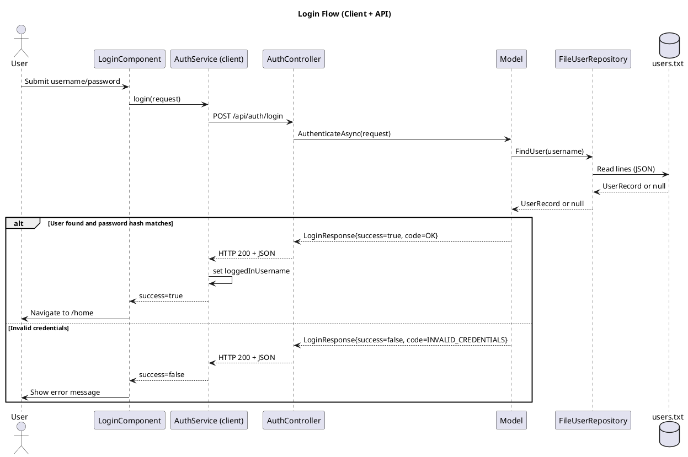
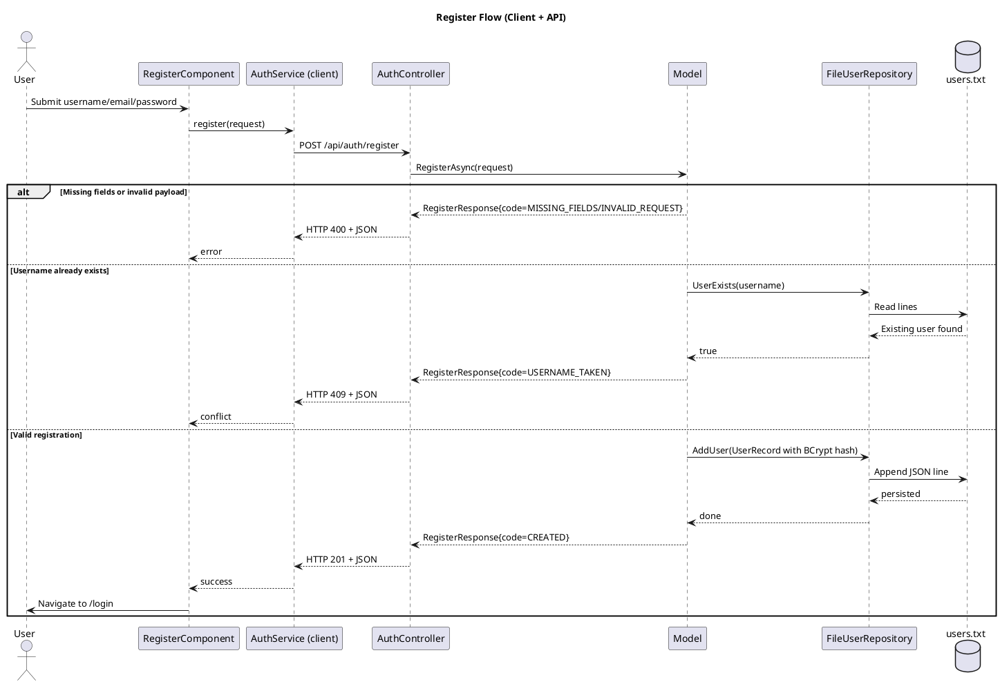
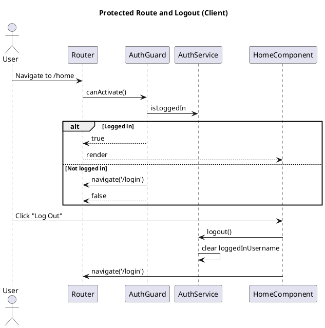
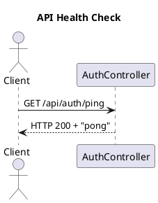

## Fluxo UML (PlantUML)

Copiar os blocos abaixo para o site https://plantuml.com/ para visualizar os diagramas.

### 1) Login Flow

### 2) Register Flow

### 3) Protected Route + Logout Flow

### 4) Health Check

