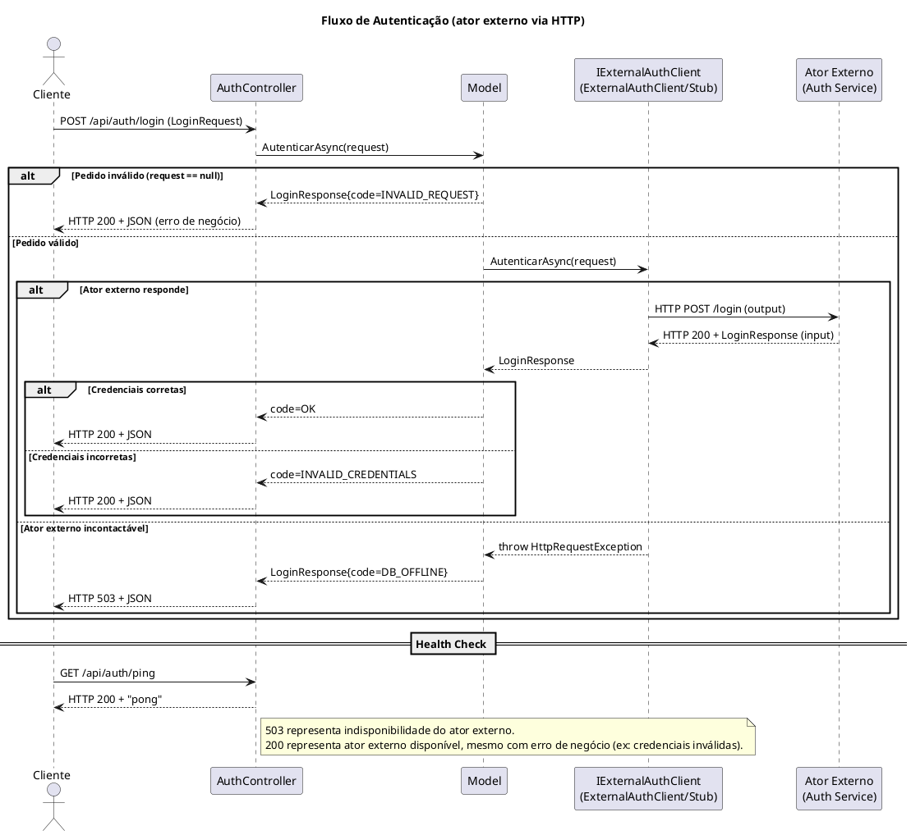
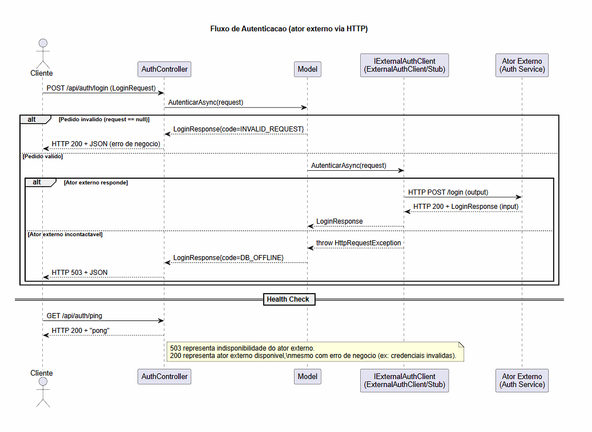

# GRUPO28_JSON

Implementação em ASP.NET Core Web API com contratos JSON mantidos, baseada na lógica do PDF "Arquitetura preliminar API JSON".

## Requisitos funcionais cobertos

- Receção de JSON com credenciais de login
- Envio de resposta em JSON
- Verificação rápida de disponibilidade da API
- Mensagens previstas:
  - "Username/Password incorreto(s)"
  - "Login efetuado com sucesso!"
  - "Base de dados inoperacional"

## Tecnologia JSON

- Newtonsoft.Json

## Endpoints

- GET /api/auth/ping
  - Retorna HTTP 200 com o texto `pong`.
- POST /api/auth/login
  - Recebe credenciais e retorna o resultado da autenticação.

### Contrato de pedido (JSON)

```json
{
  "username": "admin",
  "password": "1234"
}
```

### Contrato de resposta (JSON)

```json
{
  "success": true,
  "message": "Login efetuado com sucesso!",
  "code": "OK"
}
```

## Regras de autenticação

- Sucesso:
  - username: admin
  - password: 1234
- Credenciais inválidas:
  - qualquer combinação diferente
- Base de dados inoperacional (simulação):
  - username: db_offline
  - password: qualquer
  - retorna HTTP 503

## Como executar

```bash
dotnet restore
dotnet run
```

Por omissão, a API fica disponível em:

- http://localhost:5000
- https://localhost:5001

## Testes manuais

Iniciar a aplicação num terminal:

```bash
dotnet run
```

Num terminal separado, executar os comandos abaixo.

> **Nota Windows (PowerShell):** substituir as aspas simples por aspas duplas com escape(barra invertida), por exemplo `-d "{\"username\":\"admin\",\"password\":\"1234\"}"`.

---

### 1. Ping — verificar se a API está disponível

```bash
curl -i http://localhost:5000/api/auth/ping
```

Resposta esperada:

```
HTTP/1.1 200 OK
pong
```

---

### 2. Login com sucesso

```bash
curl -X POST http://localhost:5000/api/auth/login \
  -H "Content-Type: application/json" \
  -d '{"username":"admin","password":"1234"}'
```

Resposta esperada (`HTTP 200`):

```json
{"success":true,"message":"Login efetuado com sucesso!","code":"OK"}
```

---

### 3. Credenciais inválidas

```bash
curl -X POST http://localhost:5000/api/auth/login \
  -H "Content-Type: application/json" \
  -d '{"username":"admin","password":"errado"}'
```

Resposta esperada (`HTTP 200`):

```json
{"success":false,"message":"Username/Password incorreto/s","code":"INVALID_CREDENTIALS"}
```

---

### 4. Ator externo inoperacional (HTTP 503)

Antes de arrancar a aplicação, editar `appsettings.json` e colocar:

```json
"SimulateOffline": true
```

Iniciar a aplicação e fazer qualquer pedido de login:

```bash
curl -i -X POST http://localhost:5000/api/auth/login \
  -H "Content-Type: application/json" \
  -d '{"username":"admin","password":"1234"}'
```

Resposta esperada (`HTTP 503`):

```json
{"success":false,"message":"Base de dados inoperacional","code":"DB_OFFLINE"}
```

Repor `"SimulateOffline": false` para voltar ao modo normal.

## Fluxo UML (PlantUML)

Copiar o bloco abaixo para o site https://plantuml.com/ para visualizar o diagrama.



